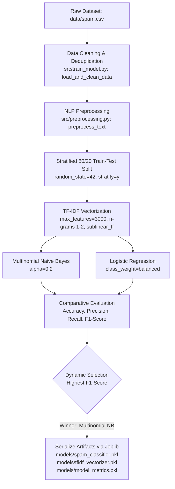
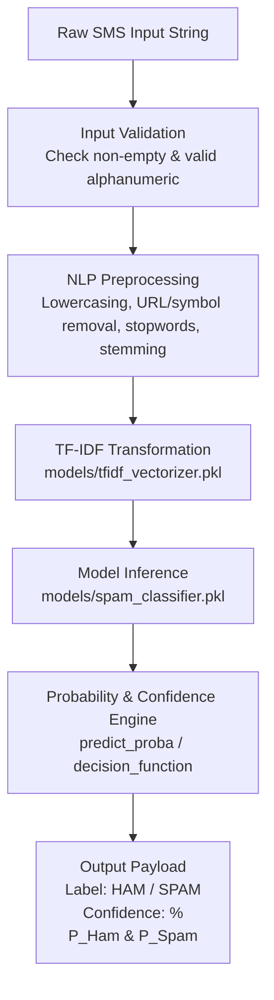

# SMS Spam Detection System

> An end-to-end Machine Learning and Natural Language Processing (NLP) system for automated SMS spam classification, featuring multi-model evaluation and an interactive Streamlit web dashboard.

---

## 📌 Table of Contents

- [Overview](#overview)
- [Project Architecture & Flows](#project-architecture--flows)
  - [1. Training & Evaluation Flow](#1-training--evaluation-flow)
  - [2. Real-Time Inference Flow](#2-real-time-inference-flow)
  - [3. In-App Retraining Flow](#3-in-app-retraining-flow)
- [Repository & File Structure](#repository--file-structure)
- [Dataset Specifications & Cleaning](#dataset-specifications--cleaning)
- [NLP Preprocessing Pipeline](#nlp-preprocessing-pipeline)
- [Feature Extraction (TF-IDF)](#feature-extraction-tf-idf)
- [Machine Learning Models](#machine-learning-models)
- [Evaluation Metrics & Benchmark Results](#evaluation-metrics--benchmark-results)
- [Streamlit Web Application Details](#streamlit-web-application-details)
- [Installation & Setup](#installation--setup)
- [Usage Guide](#usage-guide)
  - [Run the Streamlit Dashboard](#run-the-streamlit-dashboard)
  - [Train Models via Command Line](#train-models-via-command-line)
  - [Test Predictions via CLI / Python](#test-predictions-via-cli--python)
- [Model Persistence](#model-persistence)
- [Data Leakage Prevention](#data-leakage-prevention)
- [Technology Stack](#technology-stack)
- [Future Scope & Roadmap](#future-scope--roadmap)
- [Limitations](#limitations)

---

## Overview

The **SMS Spam Detection System** is designed to distinguish between legitimate communication (**Ham**) and unsolicited or fraudulent messages (**Spam**). The project combines custom NLP text normalization, sublinear TF-IDF n-gram vectorization, and supervised classification algorithms with automated model selection and a multi-tab web dashboard.

### Core Highlights
- **Automated Data Cleaning**: Detects column formats, eliminates null values, and drops duplicates (reducing 5,572 raw rows to 5,169 unique samples).
- **Dual Model Benchmarking**: Trains and evaluates **Multinomial Naive Bayes** ($\alpha=0.2$) and **Logistic Regression** (balanced weights), selecting the champion model via **F1-score**.
- **Data Leakage Immunity**: Feature extraction is strictly fitted only on the training split and transformed on the test split.
- **Interactive Web Interface**: Streamlit application featuring live inference with probability breakdown, token inspection, confusion matrices, dataset EDA charts, and one-click model retraining.

---

## Project Architecture & Flows

The project is structured around three interconnected execution flows:

### 1. Training & Evaluation Flow

Executed via `src/train_model.py` (or triggered inside `app.py`):



### 2. Real-Time Inference Flow

Executed via `src/predict.py` or the Streamlit interface in `app.py`:



### 3. In-App Retraining Flow

From the Streamlit sidebar, users can trigger full end-to-end retraining at any time:
1. Reads the latest dataset from `data/spam.csv` (or root `spam.csv`).
2. Re-runs cleaning, preprocessing, splitting, and training.
3. Overwrites all artifacts in `models/`.
4. Clears the Streamlit resource cache (`st.cache_resource.clear()`).
5. Re-renders the dashboard with updated KPIs and charts.

---

## Repository & File Structure

```text
spam_message_detection/
│
├── data/
│   └── spam.csv                     # Primary SMS Spam Collection dataset (v1: label, v2: message)
│
├── models/
│   ├── model_metrics.pkl            # Serialized evaluation metrics, confusion matrix & EDA statistics
│   ├── spam_classifier.pkl          # Serialized winning classifier (Multinomial Naive Bayes)
│   └── tfidf_vectorizer.pkl         # Serialized fitted TF-IDF vectorizer (3,000 features)
│
├── notebooks/                       # Workspace directory for exploratory notebook experiments
│
├── src/
│   ├── __init__.py                  # Python package marker
│   ├── preprocessing.py             # NLP pipeline: lowercasing, regex filtering, stopwords, Porter stemming
│   ├── train_model.py               # Ingestion, cleaning, TF-IDF, training, evaluation & serialization
│   └── predict.py                   # SpamPredictor inference class & CLI prediction runner
│
├── app.py                           # 4-tab interactive Streamlit web dashboard
├── requirements.txt                 # Python library dependencies
├── .gitignore                       # Git ignore rules for caches, virtual environments & models
└── README.md                        # Comprehensive system documentation
```

### Module Responsibilities

| File | Key Functions / Classes | Role |
| :--- | :--- | :--- |
| `src/preprocessing.py` | `preprocess_text()`, `_ensure_nltk_resources()` | Cleans raw strings into stemmed tokens using NLTK and regex. |
| `src/train_model.py` | `load_and_clean_data()`, `extract_top_words()`, `train_and_evaluate()` | End-to-end training pipeline, comparative evaluation, and joblib persistence. |
| `src/predict.py` | `SpamPredictor`, `predict_sms()`, `get_predictor()` | Decoupled inference engine with input validation and probability calibration. |
| `app.py` | `load_model_pipeline()`, Streamlit UI components | Real-time classification UI, evaluation dashboard, EDA analytics, and retraining control. |

---

## Dataset Specifications & Cleaning

The system uses the **SMS Spam Collection** dataset located at `data/spam.csv` (with automatic fallback to `spam.csv` in root).

### Ingestion & Normalization
1. **Encoding Handling**: Reads with `latin-1` encoding (fallback to `utf-8`).
2. **Column Standardization**: Maps `v1` $\rightarrow$ `label` and `v2` $\rightarrow$ `message`.
3. **Dropping Garbage Columns**: Detects and drops delimiter-created empty columns (`Unnamed: 2`, `Unnamed: 3`, `Unnamed: 4`).
4. **Label Normalization**: Strips and lowercases labels, restricting entries to `{'ham', 'spam'}`.
5. **Deduplication**: Removes duplicate messages, keeping the first occurrence.

### Dataset Profile
- **Raw Rows**: 5,572 messages
- **Duplicates Removed**: 403 messages
- **Cleaned Unique Messages**: 5,169 messages
  - **Ham (Legitimate)**: 4,516 messages (87.37%)
  - **Spam**: 653 messages (12.63%)
- **Message Length Characteristics**:
  - Ham average character length: **70.4 characters** (~15 words)
  - Spam average character length: **138.8 characters** (~24 words)

---

## NLP Preprocessing Pipeline

Implemented in `src/preprocessing.py`, the `preprocess_text()` function applies the following operations in sequence:

1. **Input Validation**: Checks for non-string, null, or whitespace-only inputs.
2. **Lowercasing**: Converts all characters to lowercase to prevent vocabulary fragmentation (`"Free"` vs `"free"`).
3. **URL Stripping**: Uses regex `r'https?://\S+|www\.\S+'` to remove web links.
4. **Punctuation & Special Character Removal**: Uses regex `r'[^a-zA-Z0-9\s]'` to remove non-alphanumeric symbols and punctuation while preserving numbers.
5. **Tokenization**: Uses `nltk.word_tokenize()` (with fallback to whitespace splitting if needed).
6. **Stopword Removal**: Eliminates common grammatical words using NLTK's English stopword corpus (`set(stopwords.words('english'))`).
7. **Stemming**: Applies NLTK's `PorterStemmer` to reduce inflected forms to their root stem (`"congratulations"` $\rightarrow$ `"congratul"`, `"winner"` $\rightarrow$ `"winner"`).
8. **Token Rejoining**: Returns a space-separated string of cleaned, stemmed tokens.

---

## Feature Extraction (TF-IDF)

Numerical feature extraction is performed using `sklearn.feature_extraction.text.TfidfVectorizer` configured with:

- `max_features=3000`: Caps the vocabulary to the top 3,000 most informative n-grams.
- `ngram_range=(1, 2)`: Captures both unigrams (`"free"`, `"cash"`) and bigrams (`"cash prize"`, `"claim now"`).
- `sublinear_tf=True`: Replaces term frequency $tf$ with $1 + \log(tf)$ to prevent repetitive keywords within a single message from dominating the vector representation.

---

## Machine Learning Models

Two supervised classifiers are trained and compared:

### 1. Multinomial Naive Bayes (`MultinomialNB`)
- **Configuration**: Additive Laplace smoothing parameter `alpha=0.2`.
- **Characteristics**: Fast, probabilistic model suited for sparse word-frequency count matrices. It assumes feature independence given the class label.

### 2. Logistic Regression (`LogisticRegression`)
- **Configuration**: `C=1.0`, `max_iter=1000`, `random_state=42`, `class_weight='balanced'`.
- **Characteristics**: Linear classifier using the logistic sigmoid function. The balanced class weight penalizes minority class misclassifications inversely proportional to class frequencies.

---

## Evaluation Metrics & Benchmark Results

The models were evaluated on an unseen **20% stratified test split** (1,034 messages: 903 Ham, 131 Spam).

### Benchmark Comparison

| Algorithm | Test Accuracy | Precision (Spam) | Recall (Spam) | F1-Score | Status |
| :--- | :---: | :---: | :---: | :---: | :---: |
| **Multinomial Naive Bayes** | **97.87%** | **95.04%** | **87.79%** | **91.27%** | 🏆 **Selected Best Model** |
| **Logistic Regression** | 97.29% | 88.72% | 90.08% | 89.39% | Baseline Comparison |

### Detailed Classification Report (Multinomial Naive Bayes)

```text
              precision    recall  f1-score   support

         Ham     0.9825    0.9934    0.9879       903
        Spam     0.9504    0.8779    0.9127       131

    accuracy                         0.9787      1034
   macro avg     0.9664    0.9356    0.9503      1034
weighted avg     0.9784    0.9787    0.9784      1034
```

### Confusion Matrix Breakdown (Test Set: 1,034 samples)

| | Predicted Ham | Predicted Spam |
| :---: | :---: | :---: |
| **Actual Ham (903)** | **897** (True Negatives) | **6** (False Positives) |
| **Actual Spam (131)** | **16** (False Negatives) | **115** (True Positives) |

> **Selection Rationale**: In SMS classification, false positives (blocking a legitimate personal or transactional message) carry a higher penalty than false negatives. Multinomial Naive Bayes achieved **95.04% Precision** (only 6 false positives out of 903 ham messages) and the highest overall **F1-score (91.27%)**, making it the optimal model.

---

## Streamlit Web Application Details

`app.py` is organized into 4 distinct views:

### 1. 💬 SMS Prediction
- Interactive message input area with a Clear button.
- 6 one-click sample buttons (3 realistic spam lures, 3 legitimate messages).
- High-visibility result cards (Green for Ham, Red for Spam) displaying confidence percentages.
- Dual probability progress bars (Ham Probability vs. Spam Probability).
- **Transformation Inspector**: Expandable panel revealing raw input, cleaned tokens, and matched active TF-IDF vocabulary weights.

### 2. 📊 Model Performance
- KPI summary cards for Accuracy, Precision, Recall, and F1-Score.
- Benchmark comparison table highlighting metric leaders.
- Seaborn confusion matrix heatmap.
- Full per-class classification report table.

### 3. 📈 Exploratory Data Analysis (EDA)
- Dataset metrics: Total Raw Rows, Duplicates Removed, Cleaned Rows, Spam Percentage.
- Ham vs. Spam class distribution pie chart.
- Message character length distribution bar chart.
- Top 10 stemmed keywords in Spam vs. Ham horizontal bar charts.

### 4. ℹ️ Project Architecture
- Comprehensive pipeline documentation.
- Explanation of applied NLP methods, TF-IDF mechanics, and model comparison rationale.

---

## Installation & Setup

### Prerequisites
- Python 3.9, 3.10, or 3.11 installed.

### Setup Steps (Windows)

1. Open a terminal in the project directory:
   ```cmd
   cd d:\5th_sem_project\spam_message_detection
   ```

2. Create a virtual environment:
   ```bash
   python -m venv venv
   ```

3. Activate the virtual environment:
   - **Command Prompt**:
     ```cmd
     venv\Scripts\activate
     ```
   - **PowerShell**:
     ```powershell
     .\venv\Scripts\Activate.ps1
     ```

4. Install the required dependencies:
   ```bash
   pip install -r requirements.txt
   ```

---

## Usage Guide

### Run the Streamlit Dashboard
```bash
streamlit run app.py
```
Open `http://localhost:8501` in your browser.

### Train Models via Command Line
To run data cleaning, text preprocessing, model training, evaluation, and artifact saving:
```bash
python src/train_model.py
```

### Test Predictions via CLI / Python

#### Via Command Line:
```bash
python src/predict.py
```

#### Via Python Code:
```python
from src.predict import predict_sms

result = predict_sms("Congratulations! You have won a £1,000 cash prize. Call 09050000327 to claim.")
print("Label:", result["label"])               # spam
print("Confidence:", result["confidence"])     # e.g., 99.4%
print("Cleaned:", result["cleaned_text"])
```

---

## Model Persistence

Trained objects are serialized in the `models/` directory using **Joblib**:
- `models/tfidf_vectorizer.pkl`: Fitted `TfidfVectorizer` vocabulary and IDF mappings.
- `models/spam_classifier.pkl`: Trained `MultinomialNB` classifier weights.
- `models/model_metrics.pkl`: Complete dictionary containing evaluation scores, confusion matrices, class distribution, and EDA stats.

This avoids retraining overhead on web application startup and ensures sub-millisecond inference times.

---

## Data Leakage Prevention

To prevent test data information from leaking into the feature extraction process:
1. The dataset is first split into training (80%) and testing (20%) subsets using stratified sampling.
2. The `TfidfVectorizer` is fitted **strictly on `X_train`**:
   ```python
   X_train_tfidf = tfidf.fit_transform(X_train)
   X_test_tfidf = tfidf.transform(X_test)
   ```
3. `X_test` is transformed using the already-fitted vectorizer without re-calculating IDF values.

---

## Technology Stack

| Category | Technology / Library | Purpose |
| :--- | :--- | :--- |
| **Language** | Python 3.9+ | Core programming language |
| **Data Processing** | Pandas, NumPy | Data cleaning, reshaping, and array operations |
| **NLP & Text Mining** | NLTK (Tokenizers, Stopwords, PorterStemmer), Regex | Text normalization and stemming |
| **Machine Learning** | Scikit-Learn | TF-IDF vectorization, MultinomialNB, LogisticRegression, Evaluation metrics |
| **Visualization** | Matplotlib, Seaborn | Confusion matrix heatmaps, EDA distribution charts |
| **Model Serialization** | Joblib | Fast disk persistence and loading of trained artifacts |
| **Web Dashboard** | Streamlit | Responsive, interactive multi-tab user interface |

---

## Future Scope & Roadmap

- **Deep Learning / Transformers**: Fine-tune transformer architectures (e.g., DistilBERT or RoBERTa) for deeper semantic representation.
- **RESTful API Endpoint**: Package the inference engine into a FastAPI microservice with Swagger documentation and Docker support.
- **Heuristic Indicators**: Combine TF-IDF features with rule-based heuristics (e.g., URL shortener count, uppercase ratio, currency symbol density).
- **Multilingual Support**: Extend preprocessing and stopwords to filter non-English SMS content.

---

## Limitations

- **Vocabulary Coverage**: Out-of-vocabulary terms or intentionally obfuscated characters (e.g., `w!n`, `fr33`) may receive diminished weights under strict bag-of-words tokenization.
- **Context Length**: Highly abbreviated single-word SMS messages (e.g., `"Ok"`, `"Call"`) offer limited semantic context for confident classification.
- **Domain Specialization**: The model is optimized for short message texts and is not designed for long-form email or document classification.
